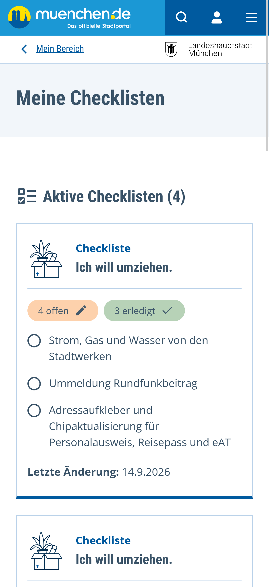
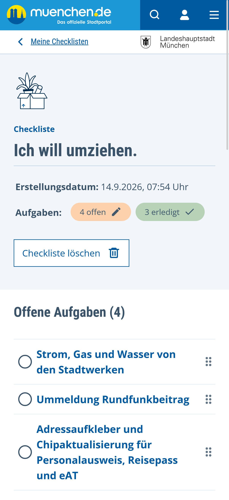
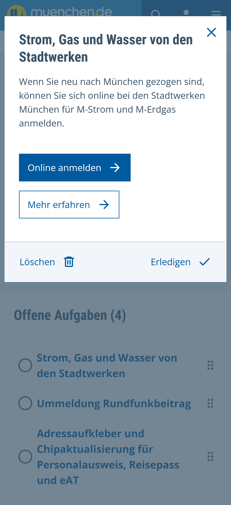

# dbs-p13n (Personalization) 🚧

The main purpose of this module currently consists of managing the checklists generated by the questionaire found on https://stadt.muenchen.de/buergerservice/lebenslagen.

In the future further personalization features of the DBS may be added, like notifications and saving favourites.

## Impressions

{float=left, width=30%}
{float=left, width=30%}
{float=left, width=30%}