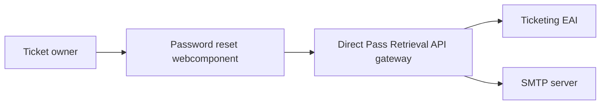

# Direct Pass Retrieval Service

The Direct Pass Retrieval Service provides a password-reset style flow for ticket direct passwords. It consists of a
Spring Boot API gateway and a Vue webcomponent packaged into the gateway artifact.

## Architecture



`POST /password/reset` sends a new time-limited link. `GET /password/{resetKey}` returns the direct password while the
link is valid. The frontend is available from the gateway root and registered as `password-reset-element`.

## Development

Requirements:

- Java 21
- Node.js 22.14 or newer
- Access to a Ticketing EAI instance, SSO client, and SMTP relay

Build and test the complete service from the repository root:

```bash
cd direct-pass-retrieval-service
mvn clean verify
```

Work on the webcomponent separately:

```bash
cd direct-pass-retrieval-service/webcomponent
npm ci
npm run lint
npm test
npm run build
```

Start the gateway locally without gateway OAuth auto-configuration:

```bash
cd direct-pass-retrieval-service/apigateway
SPRING_PROFILES_ACTIVE=local,no-security mvn spring-boot:run
```

The no-security profile is for local development only. It does not make the service safe to expose publicly.

## Configuration

Production and local credentials are supplied through environment variables. Do not put values in tracked YAML files.

| Variable                | Purpose                                              |
|-------------------------|------------------------------------------------------|
| `PRS_SSO_BASE_URL`      | SSO server base URL                                  |
| `PRS_SSO_REALM`         | OAuth realm                                          |
| `PRS_SSO_CLIENT_ID`     | OAuth client identifier                              |
| `PRS_SSO_CLIENT_SECRET` | OAuth client secret                                  |
| `PRS_EAI_URL_BASE`      | Ticketing EAI base URL                               |
| `PRS_AES_KEY`           | 32-byte AES key encoded as 64 hexadecimal characters |
| `PRS_MAIL_URL_BASE`     | Public password-reset page URL, ending in `?q=`      |

The token encryption key is a secret and must be stored in the deployment platform’s secret manager. Rotating it
invalidates outstanding reset links.

## Security

Reset tokens use AES-GCM with a fresh random 96-bit initialization vector for every token. Tokens contain a ticket
number and expiry timestamp and are rejected when malformed, tampered with, or expired.

The reset and password endpoints must be protected at the edge against automated requests. Configure rate limiting,
request-size limits, TLS, and monitoring in the ingress or API gateway. Logs intentionally exclude passwords and reset
tokens.

## Operations

The service exposes Spring Boot health, info, and Prometheus endpoints. Configure the deployment with all required
variables, SMTP reachability, EAI access, and OAuth credentials before starting it.

For validation, run `mvn clean verify` in the service directory. This builds the webcomponent, packages it into the
gateway, and runs backend checks. Run the frontend commands above when changing frontend code.
