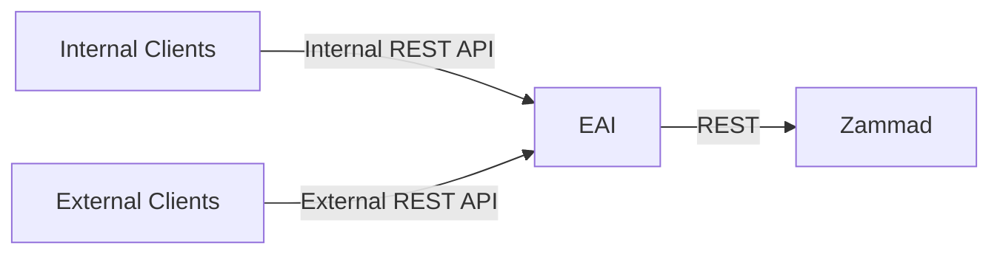
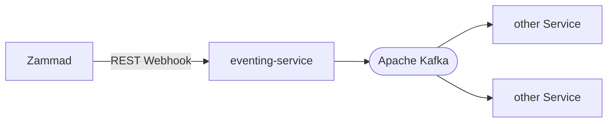

# dbs-ticketing

🚧 WIP

## ticketing-eai

EAI (enterprise application integration) for Zammad API with different endpoints for internal and external clients.

### components

- eai-service: TBD
- [api-client](https://github.com/it-at-m/dbs/tree/main/ticketing-eai/api-client-internal): Spring Java Client for making request against EAI based on eai OpenAPI spec

## ticketing-eventing

Event notification via Zammad webhooks and Apache Kafka

### Components

- [eventing-service]: Takes Zammad webhook event via REST and forwards it to Apache Kafka

## Direct Pass Retrieval Service

The [Direct Pass Retrieval Service](./direct-pass-retrieval-service) creates time-limited links that let ticket owners retrieve a ticket direct password.
