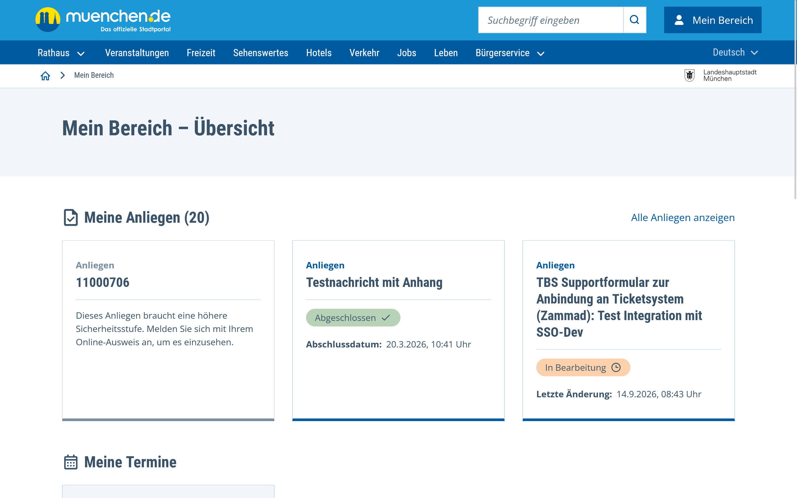

# Digital Citizen Service of the City of Munich 🚧

The **Digitaler Bürgerservice** _Digital Citizen Service_ (DBS) is a digital service provided by the municipality of the
City of Munich, designed to facilitate access to municipal services for citizens.

The platform employs a user-centered approach, allowing a citizen to

- submit requests to the administration, track their progress, and submit supporting documents
- booking and following up on appointments
- quickly identify relevant services by answering targeted, straightforward questions about their current life
  situations.

The system is built on modern web technologies and follows an Open Source model, enabling other municipalities to
leverage the source code and foster interoperability.
