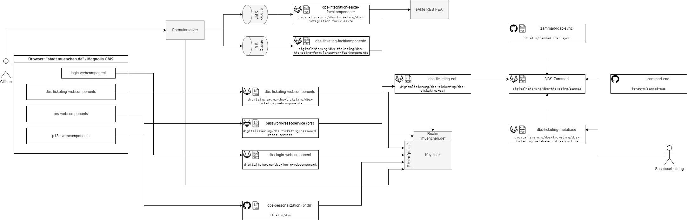

# Introduction

The DBS (Digitaler Bürgerservice / Digital Citizen Service) is a digital service provided by the government of the city of munich.

It currently consists of these modules:

- DBS-Ticketing
- DBS-P13N
- DBS-Login
- Terminvereinbarung (<https://github.com/it-at-m/eappointment>)

## Architecture

