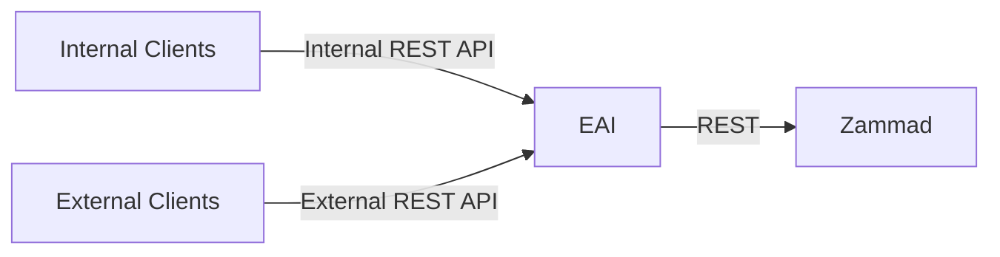

# ticketing-eai

EAI (enterprise application integration) for Zammad API with different endpoints for internal and external clients.

## components

- eai-service: TBD
- [api-client](./api-client): Spring Java Client for making request against EAI based on eai OpenAPI spec
