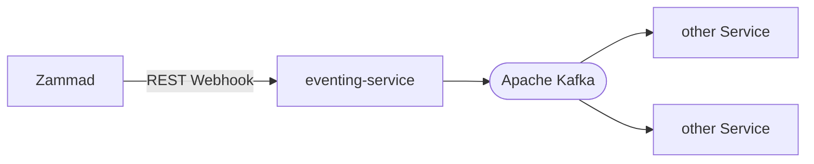

# ticketing-eventing

Event notification via Zammad webhooks and Apache Kafka



## Components

- [eventing-service]: Takes Zammad webhook event via REST and forwards it to Apache Kafka

## Local development

For local testing:

- Run DbsTicketingEventingService
- Run DbsTicketingEventingMailHandlerService

Open **Event-Service** via Swagger (http://localhost:8080/swagger-ui/index.html):
- User: zammad
- Password: password
- Method: POST `/api/event`
- X-Zammad-Trigger: `T2805_Event_Nachricht_In_Postkorb`
- X-Zammad-Delivery: `myID`
- Request Body:
```json
{
    "ticket": "3702",
    "status": "closed",
    "status_id": "1",
    "anliegenart": "technischer Bürgersupport",
    "lhmextid": "33caabe6-317c-4c2d-8bf7-6c36230599db"
}
```

Open **Kafka** (http://localhost:8089/):\
- Inspect: `Topics --> dbs-ticketing-event --> Messages`
- Should see a new corresponding event 


Open **Mailpit** (http://localhost:8025/):
- Should see a mail with the public articles of the ticket